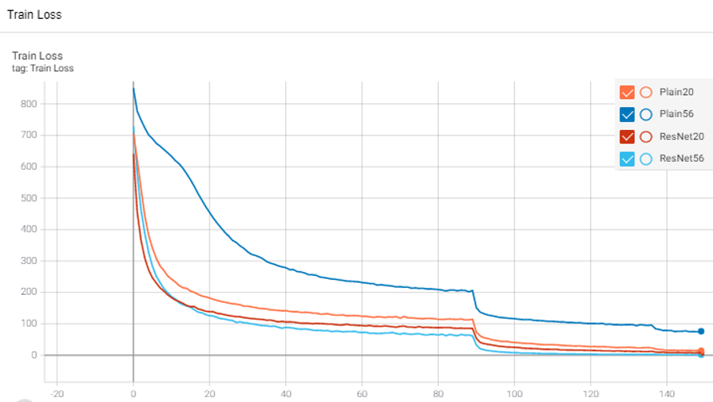
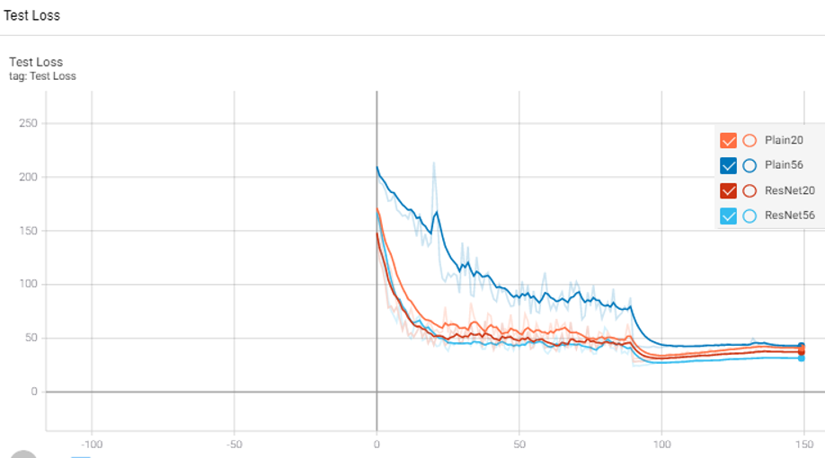

## Deep Residual Learning for Image Recognition

Deep Residual Learning for Image Recognition(이하 ResNet)은 2015년 Kaiming He, Xiangyu Zhang, Shaoqing Ren, and Jian Sun에 의해 발표된 논문으로 신경망을 깊이 구축함에 따라 발생하는 Degradation 문제를 해결했다. 이로 인해 ImageNet, CIFAR-10, Mnist, COCO 등 DataSet에 대해 Image Classification 및 Object Detection 모델의 성능을 기존 SOTA 대비 향상시켰다.

본 Repository는 ResNet을 직접 코드로 구현 해봄으로써 Degradation 발생 여부 및 ResNet의 성능을 확인해보고자 한다.  

#### Testing 환경
- DataSet
  - CIFAR-10
- Model
  - Plain-20, Plain-56, ResNet-20, ResNet-56
- Parameter
  - Batch Size: 128
  - Loss function: Cross-Entropy-Loss
  - Optimizer: SGD with weight decay=0.0001, momentum=0.9
  - Learning rate = 0.1 (iter 35000, 48000에서 1/10 수준으로 decrease)

#### 결론

- Testing 결과 **Train Loss는 Plain-56 > Plain-20 > ResNet-20 > ResNet-56 순**으로 높았다.
    - Plain-56 > Plain-20의 의미
        - **Degradation 문제가 존재**함을 증명
    - (Plain-56, Plain-20) > (ResNet-20, ResNet-56)의 의미
        - Plain Net 대비 **ResNet의 성능이 좋음**
    - ResNet-20 > ResNet-56의 의미
        - ResNet의 경우 **Degradation 문제 해결** 및 depth 증가에 따른 성능 향상

